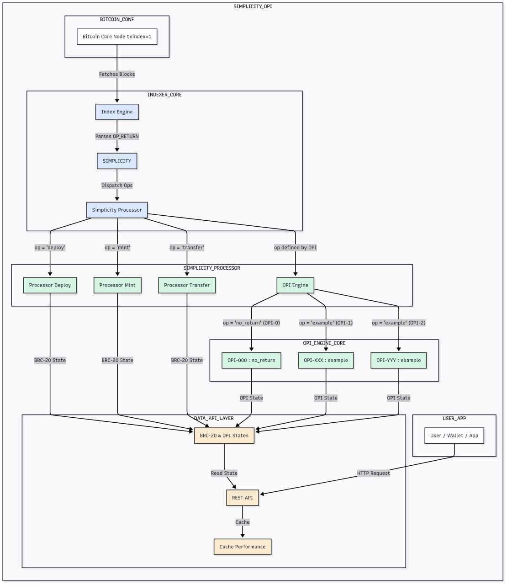

# **Simplicity: An Universal BRC-20 Indexer & OPI Framework**

[](https://github.com/The-Universal-BRC-20-Extension/simplicity/actions/workflows/ci.yml)
[](https://github.com/The-Universal-BRC20-Extension/simplicity)
[](https://opensource.org/licenses/MIT)
[](https://www.python.org/downloads/release/python-3110/)

> **The best protocol is the one we build together — block by block.**

**Simplicity** is an open-source, production-ready indexer for the Universal BRC-20 Extension, featuring a powerful and modular **Operation Proposal Improvement (OPI)** framework. It provides a robust, high-performance, and verifiable implementation of the BRC-20 standards and serves as the foundation for an evolving ecosystem of advanced DeFi protocols.

This indexer is the consensus engine that powers the entire ecosystem, transforming raw on-chain data into a structured, queryable state according to a growing set of community-driven standards.

---

## Key Features

- **High Performance:** Sub-20ms API response times for cached queries, optimized for real-time applications.
- **Extensively Tested:** 68% test coverage with 442 comprehensive tests across unit, integration, and functional test suites.
- **Protocol-Complete:** Full implementation of the Universal BRC-20 standard and a growing list of OPIs.
- **Modular OPI Framework:** A pluggable architecture that allows for the seamless addition of new operations like **OPI-1 (`swap`)** without disrupting core functionality.
- **Dockerized:** One-command deployment with Docker Compose for ease of setup.
- **Standardized API:** RESTful API with comprehensive and auto-generated OpenAPI/Swagger documentation.

---

## Architecture: The OPI Framework

Simplicity is architected around a modular **OPI (Operation Proposal Improvement)** framework. This design separates the core indexing engine from the specific logic of each protocol, allowing the system to be extended safely and efficiently.



### How the OPI Framework Works

1.  **Block Ingestion & Parsing:** The core engine fetches new blocks and scans every transaction for `OP_RETURN` outputs.
2.  **OPI Routing:** When a valid BRC-20 JSON is found, the **OPI Router** inspects the `"op"` field. It then routes the transaction data to the specific processor registered for that operation (e.g., `swap`, `no_return`).
3.  **Specialized Processing:** Each OPI processor is a self-contained module with its own parser, validator, and state transition logic. It enforces the rules of its specific operation.
4.  **Atomic State Changes:** If the operation is valid according to the processor's rules, the resulting state changes are committed atomically to the PostgreSQL database. If any validation step fails, the operation is rejected without affecting the state.

This plug-and-play architecture allows the community to propose and integrate new protocols (OPIs) without altering the indexer's core.

---

## Supported Protocols & Operations

### **Universal BRC-20 (Core)**

- `deploy`, `mint`, `transfer`: The foundational operations for creating and moving BRC-20 tokens, handled by the legacy processor.

### **OPI Framework: Extensible Protocol Architecture**

The OPI (Operation Proposal Improvement) framework allows for seamless integration of new protocols without modifying the core indexer. Each OPI is a self-contained module with its own validation logic and state management.

#### **Current OPIs:**

- **OPI-0: `no_return`** [In Development]
  - **Purpose:** Specialized operation for token burn scenarios and witness data validation
  - **Features:** Ordinals integration, witness data processing, external service validation
  - **Status:** Architecture complete, implementation in progress

#### **How to Add New OPIs:**

1. **Create OPI Module:** Implement `BaseProcessor` interface
2. **Register OPI:** Add to `ENABLED_OPIS` configuration
3. **Define Operations:** Specify supported operation types
4. **Test Integration:** Use comprehensive test suite
5. **Deploy:** Zero-downtime deployment via configuration

For detailed OPI development guide, see [OPI Developer Documentation](docs/architecture/OPI_DEVELOPER_GUIDE.md).

For OPI architecture diagrams and visual guides, see [OPI Architecture Diagrams](docs/architecture/OPI_ARCHITECTURE_DIAGRAM.md).

For maintainer-specific guidance, see [OPI Maintenance Guide](docs/architecture/OPI_MAINTENANCE_GUIDE.md).

---

## Quick Start

> **Prerequisite:** You must have a fully synced Bitcoin Core node with `txindex=1` enabled.
> See the [Deployment Guide](docs/deployment/README.md) for full setup instructions.

### Docker Compose (Recommended)

1.  **Prepare Environment:**
    ```bash
    cp .env.example .env
    ```
2.  **Configure:**
    - Edit `.env` with your Bitcoin Core RPC credentials and other secrets.
    - Ensure the Docker `DATABASE_URL` and `REDIS_URL` are active.
    - **Crucially, change all default passwords and secrets if deploying publicly.**
3.  **Launch:**
    ```bash
    docker-compose up -d
    ```
4.  **Verify:**
    ```bash
    curl http://localhost:8080/v1/indexer/brc20/health
    # Expected output: { "status": "ok" }
    ```

### Manual Installation

```bash
# Set up your environment (PostgreSQL, Redis) and configure .env
pip install pipenv
pipenv install --dev
pipenv run alembic upgrade head
pipenv run python run.py --continuous
```

### Available Commands

The project includes a comprehensive Makefile for common operations:

```bash
# Development
make install          # Install dependencies
make test            # Run all tests
make test-unit       # Run unit tests only (fast)
make test-integration # Run integration tests
make test-functional # Run functional tests
make test-coverage   # Run tests with coverage report

# Code Quality
make format          # Format code with black and isort
make lint            # Run linting checks
make clean           # Clean temporary files

# Help
make help            # Show all available commands
```

> **🔒 Security Warning:**
> If you expose any service to the internet, you **MUST** change all default passwords. Never expose PostgreSQL or Redis databases directly. Use a firewall and secure networking practices.

---

## API Documentation

A comprehensive, interactive API documentation (Swagger UI) is available at `http://localhost:8080/docs` after launching the server.

For a static overview, see the [Full API Documentation](./docs/api/README.md).

### Core Endpoints

```bash
# Health Check
curl http://localhost:8080/v1/indexer/brc20/health

# List all indexed tokens
curl http://localhost:8080/v1/indexer/brc20/list

# Get detailed information for a specific token
curl http://localhost:8080/v1/indexer/brc20/{tick}
```


---

## Testing

The integrity of the protocol is guaranteed by an exhaustive test suite organized by functionality and following industry best practices.

### Test Organization

The test suite is organized into clear categories for optimal development workflow:

```
tests/
├── unit/                          # Unit tests (237 tests) - Fast, isolated
│   ├── services/                  # Service layer tests
│   ├── models/                    # Model tests  
│   ├── utils/                     # Utility function tests
│   ├── opi/                       # OPI framework tests
│   └── api/                       # API unit tests
├── integration/                    # Integration tests (108 tests) - Database & API
├── functional/                     # Functional tests (34 tests) - End-to-end
└── scripts/                       # Shell test scripts
```

### Running Tests

#### Quick Commands (Recommended)
```bash
# Run all tests
make test

# Run only unit tests (fastest - ~5 seconds)
make test-unit

# Run integration tests
make test-integration

# Run functional tests
make test-functional

# Run fast tests (unit + integration)
make test-fast

# Run with coverage report
make test-coverage
```

#### Direct Pytest Commands
```bash
# Run all tests
pipenv run pytest tests/

# Run specific test types
pipenv run pytest tests/unit/           # Unit tests only
pipenv run pytest tests/integration/    # Integration tests only
pipenv run pytest tests/functional/     # Functional tests only

# Run tests with coverage
pipenv run pytest tests/ --cov=src --cov-report=html

# Run tests with specific markers
pipenv run pytest tests/ -m api         # API tests only
pipenv run pytest tests/ -m database    # Database tests only
pipenv run pytest tests/ -m bitcoin     # Bitcoin-related tests
```

### Test Types

- **Unit Tests** (`tests/unit/`): Fast, isolated tests that verify individual functions and methods. These run in ~5 seconds and provide immediate feedback during development.

- **Integration Tests** (`tests/integration/`): Tests that verify interactions between components, including database operations and API endpoints.

- **Functional Tests** (`tests/functional/`): End-to-end tests that verify complete workflows and complex scenarios.

- **Scripts** (`tests/scripts/`): Shell-based test utilities for manual testing and validation.

### Test Coverage

The test suite provides comprehensive coverage:
- **442 total tests** across all categories
- **68% code coverage** with detailed reporting
- **Zero breaking changes** - all existing tests preserved

### Development Workflow

1. **Fast Feedback**: Use `make test-unit` for quick validation during development
2. **Integration Testing**: Use `make test-integration` to verify component interactions
3. **Full Validation**: Use `make test` for complete test suite before commits
4. **Coverage Analysis**: Use `make test-coverage` for detailed coverage reports

---

## Contributing

We welcome contributions from the community! The OPI framework is designed for extensibility, and we encourage developers to propose and build new protocols. Please see our [Contributing Guide](CONTRIBUTING.md) for details on how to get started.

---

## License

This project is licensed under the MIT License. See the [LICENSE](LICENSE) file for details.
