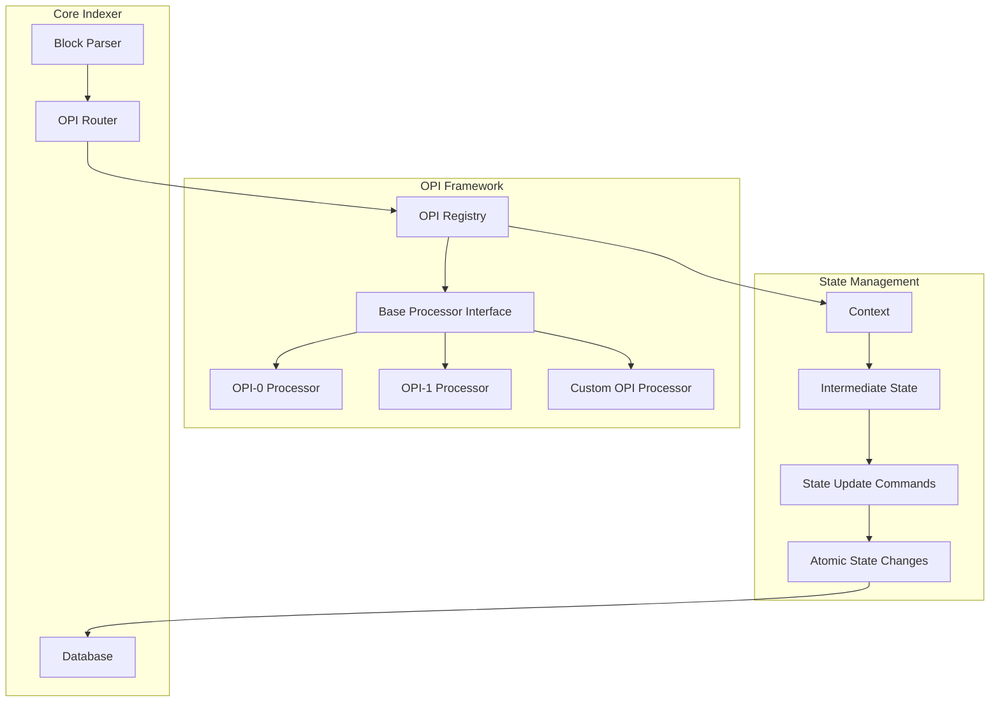
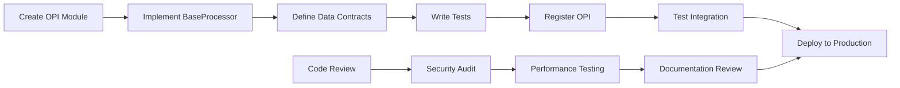
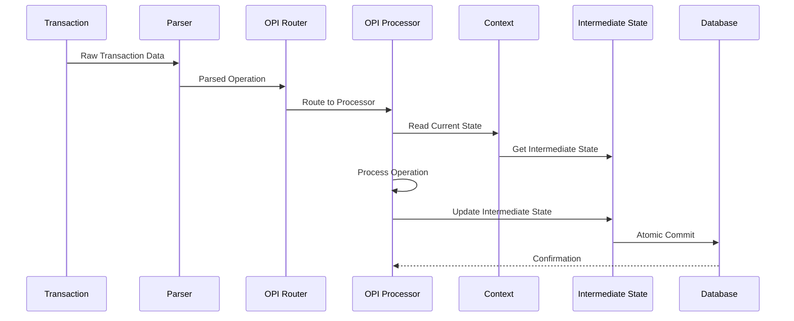
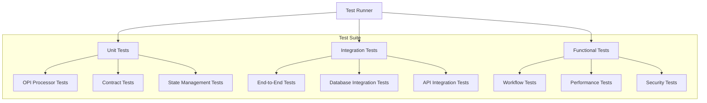
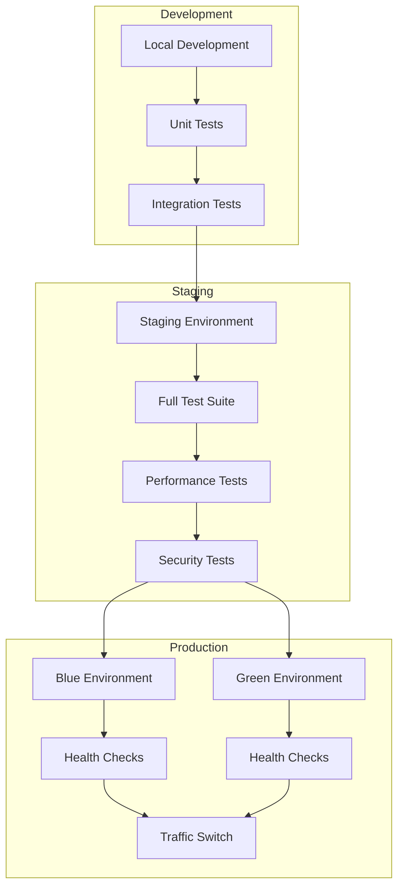
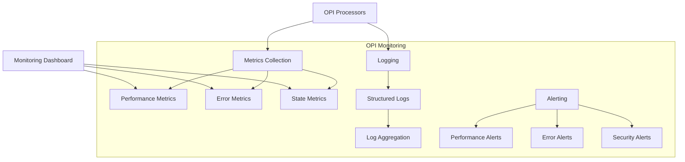
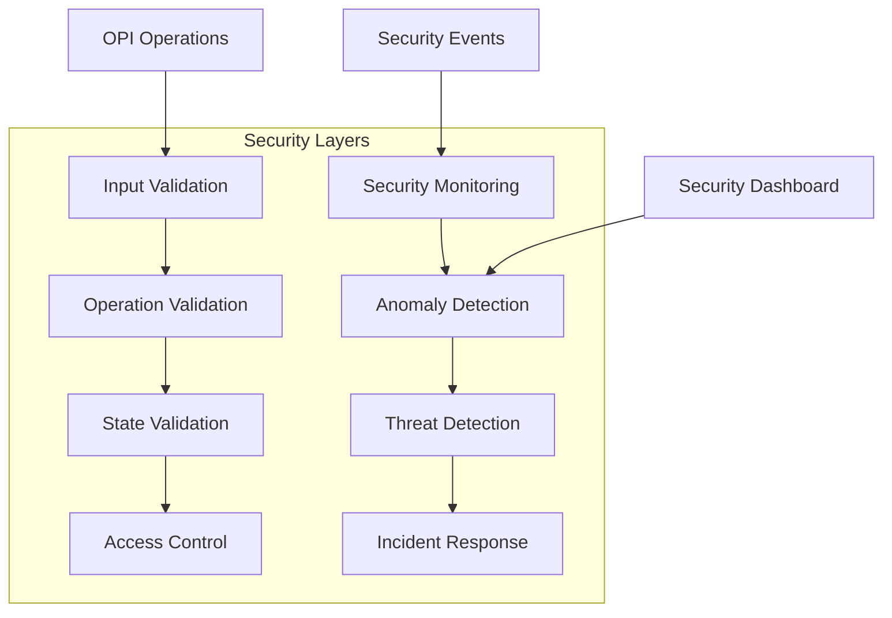

# OPI Architecture Diagram

## High-Level OPI Flow

```mermaid
graph TD
    A[Block Ingestion] --> B[Transaction Parsing]
    B --> C{OPI Router}
    C -->|op: "swap"| D[OPI-1 Processor]
    C -->|op: "no_return"| E[OPI-0 Processor]
    C -->|op: "deploy"| F[Legacy BRC20 Processor]
    D --> G[State Validation]
    E --> G
    F --> G
    G --> H[Atomic Commit]
    H --> I[Database Update]
```

## OPI Component Architecture



## OPI Development Workflow



## State Management Flow



## OPI Testing Architecture



## Deployment Architecture



## Monitoring and Observability



## Security Architecture



This comprehensive diagram set illustrates the complete OPI architecture, from high-level flow to detailed component interactions, testing strategies, deployment procedures, and security considerations.
