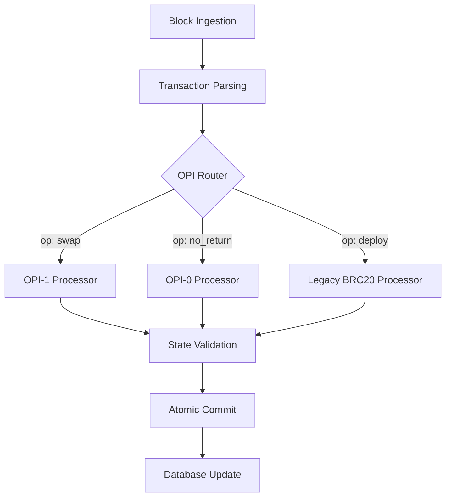

# OPI Developer Guide

> **Operation Protocol Improvement (OPI) Framework Development Guide**

This guide provides comprehensive documentation for developers and maintainers who want to create, integrate, and maintain OPI modules in the Simplicity indexer.

---

## Table of Contents

- [Overview](#overview)
- [OPI Architecture](#opi-architecture)
- [Creating Your First OPI](#creating-your-first-opi)
- [OPI Components](#opi-components)
- [State Management](#state-management)
- [Testing Your OPI](#testing-your-opi)
- [Integration & Deployment](#integration--deployment)
- [Best Practices](#best-practices)
- [Troubleshooting](#troubleshooting)

---

## Overview

The OPI (Operation Proposal Improvement) framework is a modular architecture that allows developers to extend the Simplicity indexer with new protocols without modifying the core codebase. Each OPI is a self-contained module that handles specific operation types.

### Key Benefits

- **Zero Core Modifications**: Add new protocols without touching the indexer core
- **Isolated Testing**: Each OPI can be tested independently
- **Hot Deployment**: Enable/disable OPIs via configuration
- **Type Safety**: Full TypeScript-like type checking with Python dataclasses
- **State Isolation**: Each OPI manages its own state transitions

---

## OPI Architecture

### High-Level Flow



### Core Components

1. **OPI Registry**: Routes operations to appropriate processors
2. **Base Processor**: Abstract interface for all OPI implementations
3. **State Contracts**: Type-safe data structures for state management
4. **Context System**: Read-only access to current blockchain state

---

## Creating Your First OPI

### Step 1: Project Structure

Create your OPI module in the following structure:

```
src/opi/operations/your_opi/
├── __init__.py
├── processor.py          # Main processor implementation
├── contracts.py          # Data contracts and types
├── validator.py          # Validation logic
└── tests/
    ├── __init__.py
    ├── test_processor.py
    ├── test_contracts.py
    └── test_integration.py
```

### Step 2: Implement BaseProcessor

```python
# src/opi/operations/your_opi/processor.py
from typing import List, Any, Tuple
from src.opi.base_opi import BaseProcessor
from src.opi.contracts import Context, StateUpdateCommand
from src.services.processor import ProcessingResult
from .contracts import YourOPICommand, YourOPIState

class YourOPIProcessor(BaseProcessor):
    """Processor for Your OPI operations."""
    
    def __init__(self):
        super().__init__()
        self.supported_operations = ["your_op", "another_op"]
    
    def process_operation(
        self,
        operation_data: dict,
        context: Context,
        intermediate_state: YourOPIState
    ) -> Tuple[ProcessingResult, List[StateUpdateCommand], List[Any]]:
        """
        Process a single OPI operation.
        
        Args:
            operation_data: Parsed operation data from transaction
            context: Read-only access to blockchain state
            intermediate_state: Mutable state for this block
            
        Returns:
            Tuple of (processing_result, state_commands, objects_to_persist)
        """
        try:
            # 1. Validate operation structure
            if not self._validate_operation(operation_data):
                return ProcessingResult.INVALID, [], []
            
            # 2. Extract operation parameters
            op_type = operation_data.get("op")
            params = operation_data.get("params", {})
            
            # 3. Process based on operation type
            if op_type == "your_op":
                return self._process_your_op(params, context, intermediate_state)
            elif op_type == "another_op":
                return self._process_another_op(params, context, intermediate_state)
            else:
                return ProcessingResult.INVALID, [], []
                
        except Exception as e:
            self.logger.error(f"Error processing operation: {e}")
            return ProcessingResult.ERROR, [], []
    
    def _validate_operation(self, operation_data: dict) -> bool:
        """Validate operation structure and parameters."""
        required_fields = ["op", "params"]
        return all(field in operation_data for field in required_fields)
    
    def _process_your_op(
        self, 
        params: dict, 
        context: Context, 
        intermediate_state: YourOPIState
    ) -> Tuple[ProcessingResult, List[StateUpdateCommand], List[Any]]:
        """Process your specific operation."""
        # Implementation here
        pass
    
    def _process_another_op(
        self, 
        params: dict, 
        context: Context, 
        intermediate_state: YourOPIState
    ) -> Tuple[ProcessingResult, List[StateUpdateCommand], List[Any]]:
        """Process another operation type."""
        # Implementation here
        pass
```

### Step 3: Define Data Contracts

```python
# src/opi/operations/your_opi/contracts.py
from dataclasses import dataclass
from decimal import Decimal
from typing import Dict, List, Optional
from src.opi.contracts import StateUpdateCommand

@dataclass
class YourOPICommand(StateUpdateCommand):
    """Base command for Your OPI operations."""
    operation_type: str
    params: dict

@dataclass
class YourOPIState:
    """State management for Your OPI operations."""
    # Define your OPI-specific state here
    pending_operations: List[YourOPICommand]
    processed_count: int = 0
    
    def add_operation(self, command: YourOPICommand):
        """Add a new operation to pending state."""
        self.pending_operations.append(command)
    
    def clear_operations(self):
        """Clear all pending operations."""
        self.pending_operations.clear()
        self.processed_count = 0
```

---

## OPI Components

### 1. BaseProcessor Interface

Every OPI must implement the `BaseProcessor` interface:

```python
class BaseProcessor(ABC):
    """Abstract base class for all OPI processors."""
    
    def __init__(self):
        self.supported_operations: List[str] = []
        self.logger = structlog.get_logger(self.__class__.__name__)
    
    @abstractmethod
    def process_operation(
        self,
        operation_data: dict,
        context: Context,
        intermediate_state: Any
    ) -> Tuple[ProcessingResult, List[StateUpdateCommand], List[Any]]:
        """Process a single OPI operation."""
        pass
    
    def get_supported_operations(self) -> List[str]:
        """Return list of supported operation types."""
        return self.supported_operations
```

### 2. Context System

The `Context` class provides read-only access to blockchain state:

```python
class Context:
    """Read-only view of blockchain state for OPI processors."""
    
    def __init__(self, validator, intermediate_state: IntermediateState):
        self.validator = validator
        self.intermediate_state = intermediate_state
    
    def get_balance(self, address: str, ticker: str, intermediate_balances: dict = None) -> Decimal:
        """Get current balance for address/ticker combination."""
        return self.validator.get_balance(address, ticker, intermediate_balances or {})
    
    def get_total_minted(self, ticker: str, intermediate_total_minted: dict = None) -> Decimal:
        """Get total minted amount for ticker."""
        return self.validator.get_total_minted(ticker, intermediate_total_minted or {})
    
    def get_deploy_record(self, ticker: str, intermediate_deploys: dict = None) -> Optional[dict]:
        """Get deploy record for ticker."""
        return self.validator.get_deploy_record(ticker, intermediate_deploys or {})
```

### 3. State Management

OPIs use the `IntermediateState` system for managing block-level state:

```python
@dataclass
class IntermediateState:
    """Mutable state for managing block-level operations."""
    balances: Dict[Tuple[str, str], Decimal] = field(default_factory=dict)
    total_minted: Dict[str, Decimal] = field(default_factory=dict)
    deploys: Dict[str, dict] = field(default_factory=dict)
    
    def add_balance(self, address: str, ticker: str, amount: Decimal):
        """Add balance to intermediate state."""
        key = (address, ticker)
        self.balances[key] = self.balances.get(key, Decimal("0")) + amount
    
    def set_total_minted(self, ticker: str, amount: Decimal):
        """Set total minted amount."""
        self.total_minted[ticker] = amount
```

---

## State Management

### State Update Commands

OPIs communicate state changes through `StateUpdateCommand` objects:

```python
@dataclass
class BalanceUpdateCommand(StateUpdateCommand):
    """Command to update a balance."""
    address: str
    ticker: str
    amount: Decimal
    operation: str  # "add", "subtract", "set"

@dataclass
class TotalMintedUpdateCommand(StateUpdateCommand):
    """Command to update total minted amount."""
    ticker: str
    amount: Decimal
    operation: str  # "add", "set"

@dataclass
class DeployCommand(StateUpdateCommand):
    """Command to deploy a new token."""
    ticker: str
    deploy_data: dict
```

### Processing Results

```python
class ProcessingResult(Enum):
    SUCCESS = "success"
    INVALID = "invalid"
    ERROR = "error"
    SKIPPED = "skipped"
```

---

## Testing Your OPI

### Unit Tests

```python
# tests/unit/opi/operations/test_your_opi.py
import pytest
from unittest.mock import Mock, patch
from src.opi.operations.your_opi.processor import YourOPIProcessor
from src.opi.contracts import Context, IntermediateState

class TestYourOPIProcessor:
    
    def setup_method(self):
        self.processor = YourOPIProcessor()
        self.mock_validator = Mock()
        self.context = Context(self.mock_validator, IntermediateState())
        self.intermediate_state = IntermediateState()
    
    def test_process_your_op_success(self):
        """Test successful processing of your_op operation."""
        operation_data = {
            "op": "your_op",
            "params": {"amount": "100", "ticker": "TEST"}
        }
        
        result, commands, objects = self.processor.process_operation(
            operation_data, self.context, self.intermediate_state
        )
        
        assert result == ProcessingResult.SUCCESS
        assert len(commands) > 0
        assert isinstance(commands[0], YourOPICommand)
    
    def test_process_invalid_operation(self):
        """Test handling of invalid operations."""
        operation_data = {"invalid": "data"}
        
        result, commands, objects = self.processor.process_operation(
            operation_data, self.context, self.intermediate_state
        )
        
        assert result == ProcessingResult.INVALID
        assert len(commands) == 0
```

### Integration Tests

```python
# tests/integration/test_your_opi_integration.py
import pytest
from src.opi.operations.your_opi.processor import YourOPIProcessor
from src.opi.registry import OPIRegistry

class TestYourOPIIntegration:
    
    def test_opi_registration(self):
        """Test that OPI is properly registered."""
        registry = OPIRegistry()
        processor = YourOPIProcessor()
        
        registry.register_processor("your_opi", processor)
        
        assert "your_opi" in registry.get_registered_processors()
        assert registry.get_processor("your_opi") == processor
    
    def test_end_to_end_processing(self):
        """Test complete processing flow."""
        # Implementation here
        pass
```

---

## Integration & Deployment

### Step 1: Register Your OPI

Add your OPI to the configuration:

```python
# src/config.py
class Settings(BaseSettings):
    # ... existing settings ...
    
    ENABLED_OPIS: List[str] = [
        "test_opi",  # Existing test OPI
        "your_opi",  # Your new OPI
    ]
```

### Step 2: Update OPI Registry

```python
# src/opi/registry.py
def _initialize_processors(self) -> Dict[str, BaseProcessor]:
    """Initialize all enabled OPI processors."""
    processors = {}
    
    for opi_name in self.settings.ENABLED_OPIS:
        if opi_name == "test_opi":
            from src.opi.operations.test_opi.processor import TestOPIProcessor
            processors[opi_name] = TestOPIProcessor()
        elif opi_name == "your_opi":
            from src.opi.operations.your_opi.processor import YourOPIProcessor
            processors[opi_name] = YourOPIProcessor()
        # Add more OPIs as needed
    
    return processors
```

### Step 3: Update Parser

Add your operation types to the parser:

```python
# src/services/parser.py
def _is_opi_operation(self, operation_data: dict) -> bool:
    """Check if operation should be handled by OPI framework."""
    opi_operations = ["your_op", "another_op"]  # Add your operations
    return operation_data.get("op") in opi_operations
```

### Step 4: Database Migrations

If your OPI requires new database tables or columns:

```bash
# Create new migration
pipenv run alembic revision --autogenerate -m "Add your_opi tables"

# Apply migration
pipenv run alembic upgrade head
```

### Step 5: Testing & Validation

```bash
# Run all tests
make test

# Run OPI-specific tests
pipenv run pytest tests/unit/opi/operations/test_your_opi/
pipenv run pytest tests/integration/test_your_opi_integration.py

# Run with coverage
pipenv run pytest tests/ --cov=src/opi/operations/your_opi/
```

---

## Best Practices

### 1. Error Handling

```python
def process_operation(self, operation_data: dict, context: Context, intermediate_state: Any):
    try:
        # Your processing logic
        pass
    except ValidationError as e:
        self.logger.warning(f"Validation error: {e}")
        return ProcessingResult.INVALID, [], []
    except Exception as e:
        self.logger.error(f"Unexpected error: {e}", exc_info=True)
        return ProcessingResult.ERROR, [], []
```

### 2. Logging

```python
import structlog

class YourOPIProcessor(BaseProcessor):
    def __init__(self):
        super().__init__()
        self.logger = structlog.get_logger(self.__class__.__name__)
    
    def process_operation(self, ...):
        self.logger.info("Processing operation", op_type=operation_data.get("op"))
        # ... processing logic ...
        self.logger.info("Operation processed successfully")
```

### 3. State Validation

```python
def _validate_state_transition(self, current_state: dict, new_command: StateUpdateCommand) -> bool:
    """Validate that state transition is valid."""
    # Implement your validation logic
    return True
```

### 4. Performance Considerations

- **Minimize Database Calls**: Use context methods instead of direct DB access
- **Batch Operations**: Process multiple operations in a single transaction
- **Memory Management**: Clear intermediate state after processing
- **Async Operations**: Use async/await for I/O operations when possible

---

## Troubleshooting

### Common Issues

#### 1. OPI Not Processing Operations

**Symptoms**: Operations are not being routed to your OPI processor.

**Solutions**:
- Check that your OPI is in `ENABLED_OPIS` configuration
- Verify operation types are in `supported_operations` list
- Ensure parser recognizes your operation types

#### 2. State Not Updating

**Symptoms**: State changes are not being applied.

**Solutions**:
- Verify `StateUpdateCommand` objects are being returned
- Check that commands are properly structured
- Ensure state validation passes

#### 3. Test Failures

**Symptoms**: Tests are failing unexpectedly.

**Solutions**:
- Check mock objects are properly configured
- Verify test data matches expected format
- Ensure all dependencies are imported correctly

### Debug Mode

Enable debug logging for your OPI:

```python
# In your processor
self.logger = structlog.get_logger(self.__class__.__name__)
self.logger.debug("Debug information", operation_data=operation_data)
```

### Performance Profiling

```python
import time
from functools import wraps

def profile_method(func):
    @wraps(func)
    def wrapper(self, *args, **kwargs):
        start_time = time.time()
        result = func(self, *args, **kwargs)
        end_time = time.time()
        self.logger.info(f"Method {func.__name__} took {end_time - start_time:.4f}s")
        return result
    return wrapper

class YourOPIProcessor(BaseProcessor):
    @profile_method
    def process_operation(self, ...):
        # Your implementation
        pass
```

---

## Conclusion

The OPI framework provides a powerful and flexible way to extend the Simplicity indexer with new protocols. By following this guide and the established patterns, you can create robust, testable, and maintainable OPI modules that integrate seamlessly with the existing codebase.

For additional support or questions, please refer to the main project documentation or open an issue in the repository.

---

**Happy Coding! 🚀**
