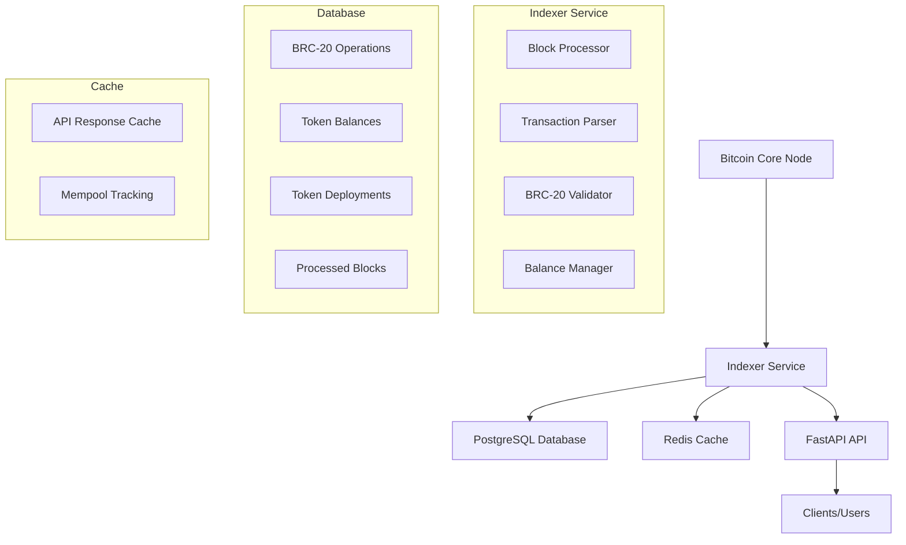

# Simplicity Indexer Architecture

## System Overview

Simplicity Indexer is a high-performance BRC-20 token indexing system that processes Bitcoin blockchain data to extract and index BRC-20 token operations. The system consists of:

- **Bitcoin Core node**: Provides Bitcoin blockchain data (requires `txindex=1`)
- **Indexer service**: Processes blocks and transactions, validates BRC-20 operations, updates database and cache
- **PostgreSQL**: Stores indexed data, balances, deployments, and operations
- **Redis**: Caching layer for fast API responses and mempool tracking
- **FastAPI**: Exposes REST API endpoints with automatic OpenAPI documentation

## Architecture Diagram



## Core Components

### Indexer Service
The main processing engine that:
- Fetches new blocks from Bitcoin Core
- Parses transactions for BRC-20 operations
- Validates operations according to BRC-20 protocol rules
- Updates database with valid operations
- Manages token balances and deployments
- Handles reorgs and chain reorganizations

### BRC-20 Processor
Handles the core BRC-20 protocol logic:
- **Deploy**: Creates new token deployments
- **Mint**: Processes token minting operations
- **Transfer**: Handles token transfers between addresses
- **Multi-transfer**: Supports batch transfer operations

### Validation System
Ensures all operations comply with BRC-20 standards:
- Protocol compliance validation
- Balance validation for transfers
- Supply limit enforcement
- Marketplace transfer validation

### API Layer
Provides RESTful endpoints for:
- Token information and statistics
- Address balances and history
- Block-level operation queries
- Health and status monitoring

## Data Flow

1. **Block Ingestion**: Indexer fetches new blocks from Bitcoin Core
2. **Transaction Processing**: Each transaction is scanned for OP_RETURN data
3. **BRC-20 Detection**: Valid BRC-20 JSON operations are identified
4. **Validation**: Operations are validated against protocol rules
5. **State Updates**: Valid operations update database state
6. **Cache Updates**: API cache is refreshed with new data
7. **API Response**: Clients receive updated data via REST API

## Repository Structure

```
src/
├── api/                    # API routes and models
│   ├── main.py            # FastAPI application setup
│   ├── models.py          # API response models
│   └── routers/           # API endpoint definitions
├── services/              # Core business logic
│   ├── indexer.py         # Main indexing service
│   ├── processor.py       # BRC-20 operation processor
│   ├── validator.py       # Operation validation
│   ├── parser.py          # Transaction parsing
│   └── bitcoin_rpc.py     # Bitcoin Core RPC client
├── models/                # Database models
│   ├── base.py           # Base model class
│   ├── balance.py        # Token balance model
│   ├── deploy.py         # Token deployment model
│   └── transaction.py    # BRC-20 operation model
├── database/              # Database connection and setup
├── utils/                 # Utility functions
└── config.py             # Application configuration

tests/                     # Comprehensive test suite
├── unit/                 # Unit tests
├── integration/          # Integration tests
└── performance/          # Performance tests

docs/                     # Documentation
├── api/                  # API documentation
├── architecture/         # Architecture docs
├── deployment/           # Deployment guides
└── development/          # Development guides
```

## Performance Characteristics

- **API Response Time**: <20ms average for cached queries
- **Block Processing**: Real-time processing of new blocks
- **Database Queries**: Optimized for sub-20ms response times
- **Memory Usage**: <512MB baseline
- **Concurrent Users**: Supports 100+ simultaneous API users

## Security Features

- Input validation and sanitization
- SQL injection prevention via ORM
- Error handling without information disclosure
- Secure configuration management
- Rate limiting and access controls 