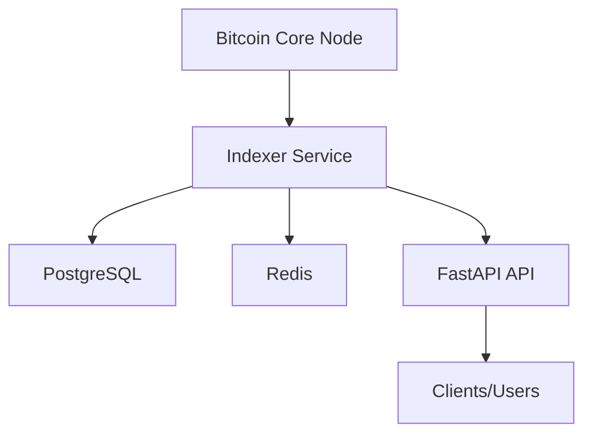

# Simplicity Indexer Architecture

## System Overview
Simplicity Indexer consists of:
- **Bitcoin Core node**: Provides Bitcoin data (requires txindex=1)
- **Indexer service**: Processes blocks and transactions, updates database and cache
- **PostgreSQL**: Stores indexed data
- **Redis**: Caching layer for fast API responses
- **FastAPI**: Exposes REST API endpoints

## Functional Diagram

## Repository Structure
- `src/` — Main application code
- `src/api/` — API routes and models
- `src/services/` — Core business logic and Bitcoin processing
- `src/models/` — Database models
- `src/database/` — Database connection and setup
- `src/utils/` — Utility functions
- `alembic/` — Database migrations
- `tests/` — Test suite 